# 🎌 Anime Popularity Analysis

A complete end-to-end Data Science project analyzing anime popularity trends
using the MyAnimeList dataset with Python, MySQL, and Power BI.

---

## 📊 Dashboard Preview

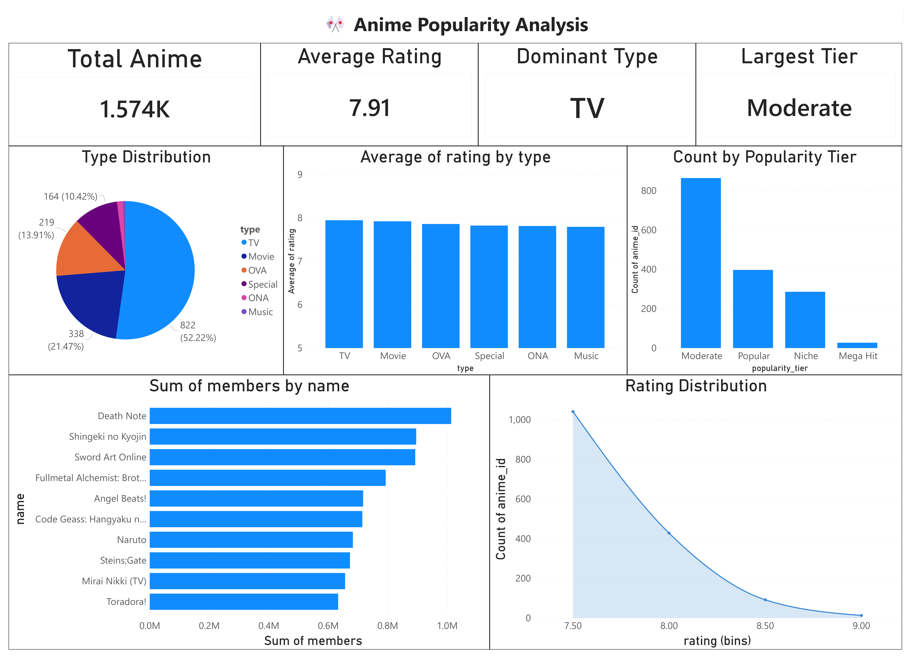

---

## 🛠️ Tools Used

| Tool | Purpose |
|------|---------|
| Python (Google Colab) | Data cleaning and EDA |
| Pandas and Seaborn | Data manipulation and visualization |
| MySQL | SQL analysis and querying |
| Power BI | Interactive dashboard |
| GitHub | Version control and portfolio |

---

## 📁 Dataset

| File | Description |
|------|-------------|
| anime.csv | 12,294 anime titles with genre, type, rating, members |
| rating.csv | 7.8 million user ratings |

**Source:** [MyAnimeList Dataset on Kaggle](https://www.kaggle.com/datasets/CooperUnion/anime-recommendations-database)

---

## 📂 Project Structure

```
anime-popularity-analysis/
├── notebooks/
│   └── Anime_Popularity_Analysis.ipynb
├── sql/
│   └── anime_analysis.sql
├── data/
│   ├── anime_cleaned.csv
│   └── rating_cleaned.csv
├── dashboard/
│   └── anime.png
├── images/
│   ├── plot1 to plot12 charts
│   └── q1 to q10 SQL screenshots
└── README.md
```

---

## 📈 Visualizations

### Rating Distribution


### Top 10 Genres
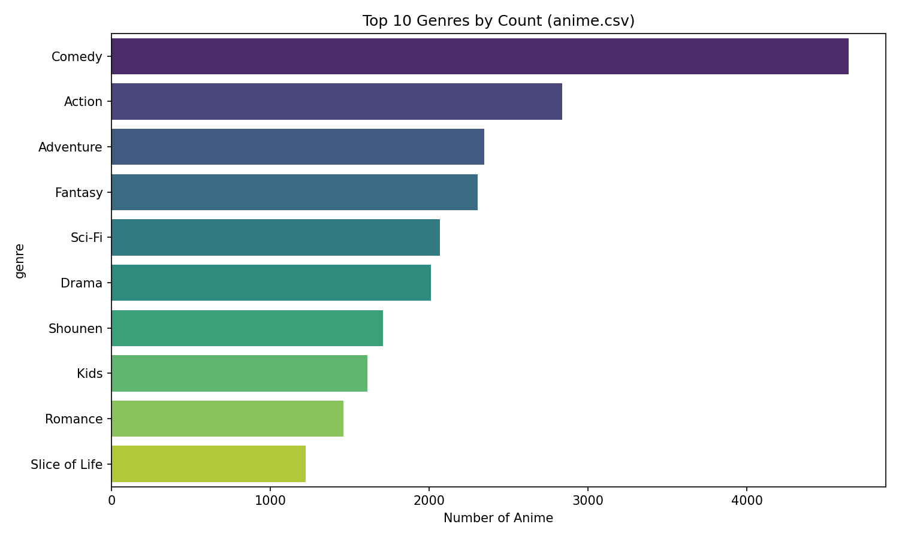

### Average Rating by Genre
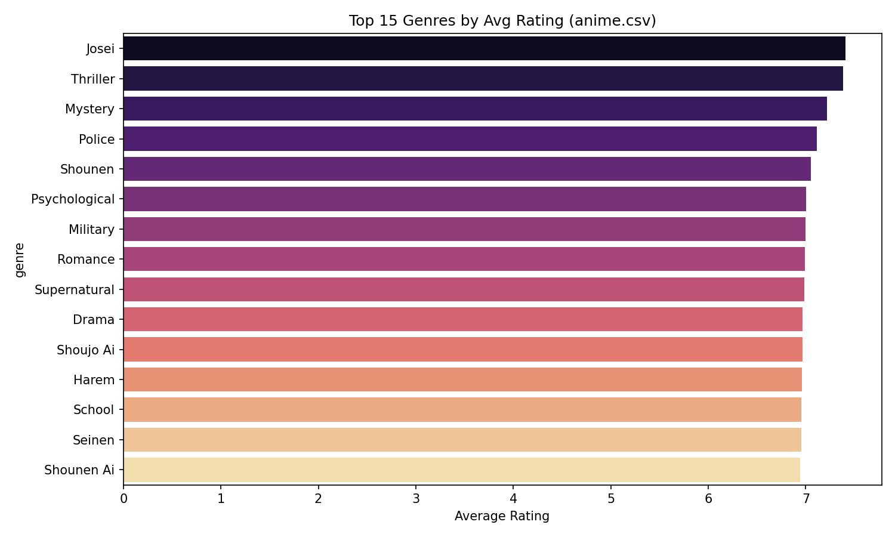

### Members vs Rating


### Correlation Heatmap
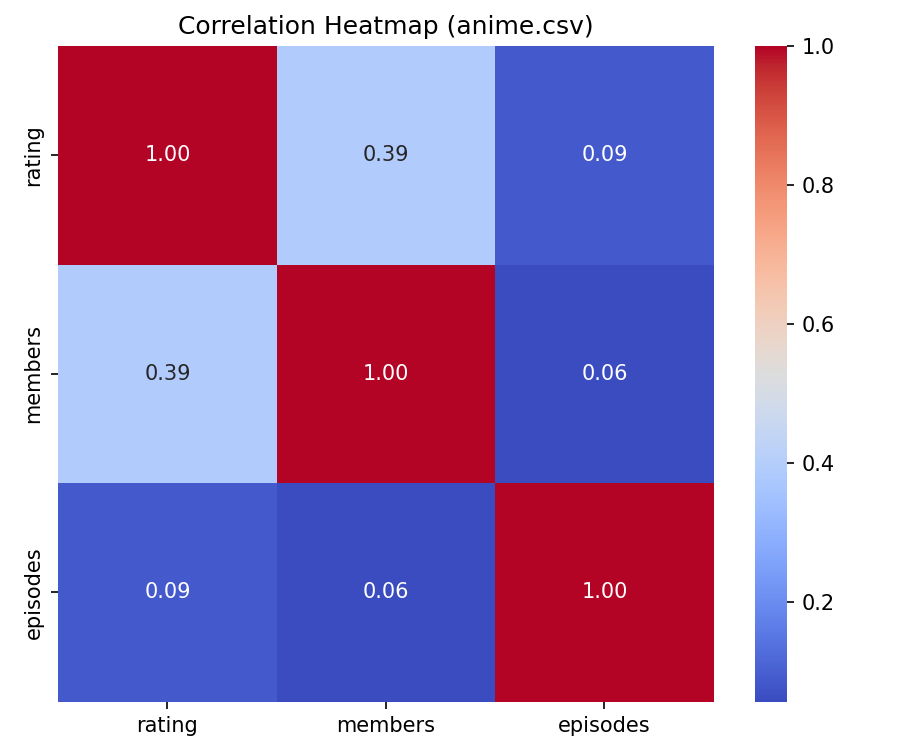

### Word Cloud of Anime Names
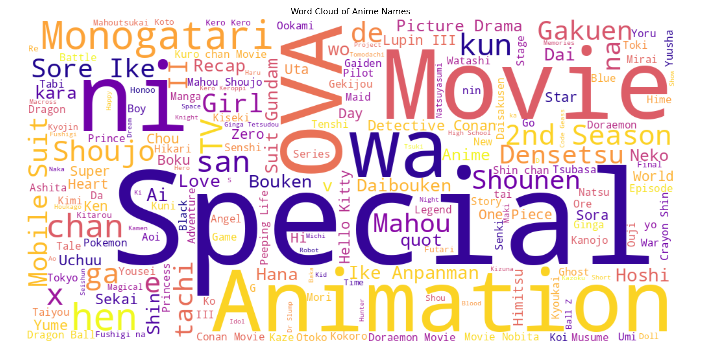

---

## 🗄️ SQL Analysis

10 queries covering basic analysis, GROUP BY, JOIN and window functions:

| Query | Description |
|-------|-------------|
| Q1 | Top 10 highest rated anime |
| Q2 | Top 10 most popular by members |
| Q3 | Average rating by type |
| Q4 | Count per popularity tier |
| Q5 | Count per episode bucket |
| Q6 | Anime above average rating |
| Q7 | JOIN — anime with avg user rating |
| Q8 | JOIN — rating difference |
| Q9 | Window function — top 3 per type |
| Q10 | Window function — percentile rank |

### SQL Query Screenshots

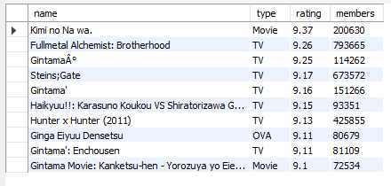
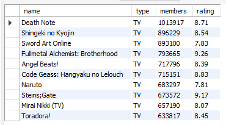
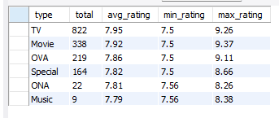
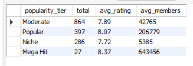
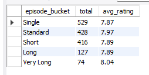
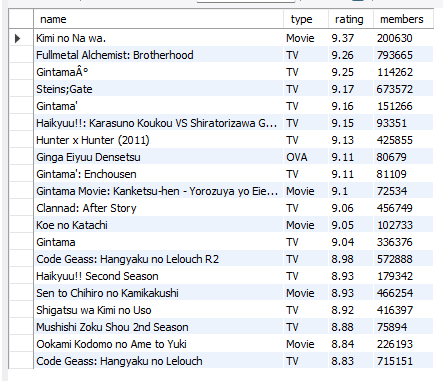
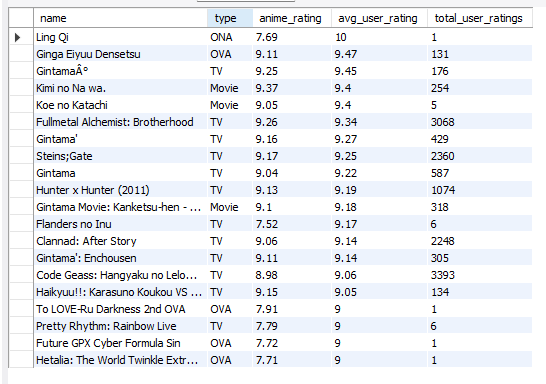
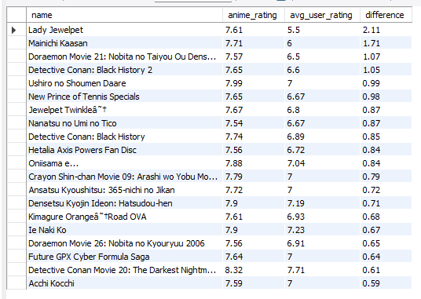
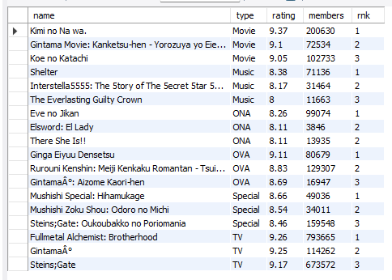
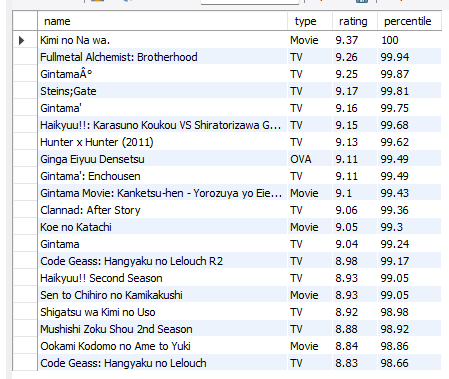

---

## 🔍 Key Findings

1. Most anime are rated between **6 and 8** out of 10
2. **Comedy** is the most common genre but niche genres score higher on average
3. **Movies** have the highest median rating compared to other types
4. High member count does **not always** mean high rating
5. Over **70% of anime** fall in the Niche tier with fewer than 10,000 members
6. Average user rating is slightly lower than the official anime rating
7. Most TV anime are short series of **12 to 26 episodes**

---

## 🚀 How to Run

```
1. Download anime.csv and rating.csv from Kaggle
2. Open Anime_Popularity_Analysis.ipynb in Google Colab
3. Upload both CSV files when prompted
4. Run all cells top to bottom
5. Download cleaned CSV files
6. Import anime_cleaned.csv into MySQL
7. Run anime_analysis.sql queries in MySQL Workbench
8. Open Power BI Desktop
9. Connect to MySQL database
10. Build dashboard using cleaned data
```

---

## 📊 Project Workflow

```
Kaggle Dataset
     ↓
Google Colab (Python)
  - Data cleaning
  - EDA
  - 12 Visualizations
     ↓
MySQL
  - Import cleaned CSV
  - 10 SQL queries
  - Basic, JOIN, Window functions
     ↓
Power BI
  - Connect to MySQL
  - Interactive dashboard
  - 9 Visuals
     ↓
GitHub
  - Portfolio ready
```

---

## 👤 Author

**Amancha Shashank**
Data Science Student

[GitHub Profile](https://github.com/Shashank-Amancha)

---

*Project built as part of Data Science Portfolio — 2026*
